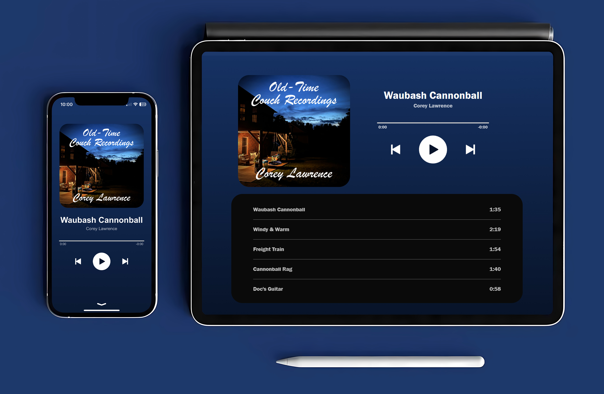

# Corey Lawrence Music React Web App

Welcome to the Corey Lawrence Music React Web App! This single-page web app is a React version of the original [Corey Lawrence Music Web App](https://github.com/CoreyMLawrence/Corey-Lawrence-Music/). It offers a revamped user interface and enhanced functionalities while still providing you with the seamless music experience you love.

## Screenshots
   

## Overview

This music player is built using React and offers an improved and modernized experience for enjoying Corey Lawrence's music. It inherits many features from the original app and introduces some new ones, including:

- Updated UI with React components
- Enhanced performance and responsiveness
- Improved code organization and maintainability

## Features

- **Play/Pause:** Easily control playback with a simple click on the play/pause button.
- **Song Selection:** Choose your desired song from the menu, featuring a list of Corey Lawrence's tracks. The menu is implemented dynamically using React components, allowing for easy addition of new songs without modifying the HTML code.
- **Progress Bar:** Track the progress of the currently playing song with the interactive progress bar.
- **Smooth Scrolling:** Navigate through the app smoothly with smooth scrolling functionality.
- **Media Session API Integration:** Control the music player directly from your device's lock screen or notification center using the Media Session API. This integration allows you to play, pause, skip forward, and skip backward without having to unlock your device or open the app.
- **Responsive Design:** Optimized for both mobile and larger screens using CSS and React, ensuring a fantastic user experience across all devices.

## Usage

1. Visit [coreylawrencemusic.duckdns.org](https://coreylawrencemusic.duckdns.org) in your web browser.
2. Press play, or select a song from the menu.
3. Enjoy Corey Lawrence's music!

## Technologies Used

The Corey Lawrence Music React Web App leverages several modern technologies to deliver a seamless and immersive music experience:

- **React**: The app is built using React, a JavaScript library for building user interfaces. React provides a component-based architecture, allowing for efficient and reusable code organization. The use of React enables the creation of interactive and dynamic user interfaces with ease.

- **@emotion/react**: This library is used for styling components with CSS-in-JS (JavaScript Styles). Emotion provides a powerful and flexible solution for styling React components, offering features such as scoped styles, theming, and dynamic styles based on props or state.

- **Material-UI Icons**: Material-UI provides a collection of high-quality icons that are used throughout the app's user interface. Icons such as PlayArrowIcon, PauseIcon, SkipNextIcon, and SkipPreviousIcon enhance the visual presentation of player controls and navigation elements.

- **@mui/material**: Material-UI is a popular React UI framework that implements Google's Material Design guidelines. The @mui/material package provides a wide range of pre-designed React components, including LinearProgress, ButtonGroup, and Typography. These components are used to create a polished and consistent user interface, with features such as progress bars, button groups, and typography styling.

- **useState, useRef, useEffect Hooks**: React hooks are used extensively in the app to manage component state, handle side effects, and interact with the underlying DOM. The useState hook is used to manage stateful data such as playback status and track information. The useRef hook is used to create references to DOM elements, enabling direct manipulation and interaction. The useEffect hook is used to perform asynchronous operations and side effects, such as fetching data or subscribing to events.

These technologies work together to create a modern and responsive music player experience, offering users a seamless way to enjoy Corey Lawrence's music.

## Menu Implementation

- The menu is dynamically generated using React components. The list of songs is stored in an array, and for each song, a corresponding React component is created and rendered within the menu component. This approach allows for easy maintenance and scalability, as adding or removing songs only requires updating the JavaScript array.

- The menu is easily accessed and hidden with a simple swipe up or down gesture, providing a completely natural and intuitive user experience.

## Media Session API Integration

The JavaScript code utilizes the Media Session API to provide seamless control over the music player from the user's lock screen or notification center. By setting metadata such as the song title, artist, and album, as well as defining action handlers for play, pause, skip forward, and skip backward events, the app seamlessly integrates with the device's media controls.

## Hosting

This web app is hosted on a server located inside my home. I have configured Nginx along with SSL through Let's Encrypt, ensuring secure access to the app. With 24/7 hosting directly from my home server, users can access Corey Lawrence's music anytime, anywhere.

For the original version of this app, please visit [Corey-Lawrence-Music GitHub Repository](https://github.com/CoreyMLawrence/Corey-Lawrence-Music/).
